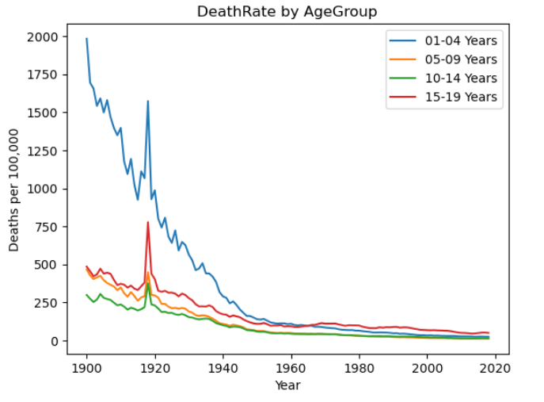
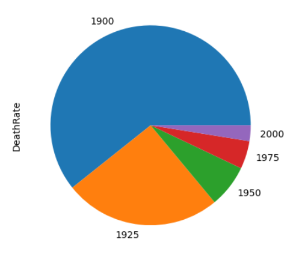

# Python 

**Keith Faunce**

This portfolio highlights a selection of my work in **Python**, with a focus on data analysis and problem-solving using **Pandas** and **NumPy**. Each project demonstrates different aspects of coding, from automating tasks to building analytical pipelines. 

_For machine learning models, training sets, and predictive analysis studies, please see the “Machine Learning” section of my portfolio._

 

## Analysis of Tesla Stock (TSLA) 2011-2019

This program analyzes Tesla’s monthly stock performance based on user input. It can calculate opening price, highest price, closing price, stock volume, and more. Instructions for running the analysis are included at the top of the script.  

[Tesla Stock .csv file](projects/TeslaStock.csv)

[Tesla Stock Analysis](projects/tesla_project_keith_f.ipynb)

 

## Automated Response Chatbot

A chatbot built with Python and integrated into LINE’s messaging platform. It provides automated keyword-based responses and showcases real world use of APIs and Flask.

[Chatbot README](https://github.com/WizzyHarry/line-bot)

 

## Mortality Data Analysis 1900-2012

The mortality data analysis explores child mortality rates (ages 1–19) in the U.S. from 1900–2012 using an **ETL (Extract, Transform, Load)** framework. By the end of the analysis you can visualize how medical practices have drastically improved over roughly the last century.

_Data files can be found at the top of the notebook_

[Mortality Data Analysis](code_packages/mortality_pd.ipynb)

### Visualization from the Analysis

| 

 | 

 |
|-----------------------------------------------|-----------------------------------------------|

 

## Convenience Store Inventory Management System

A script that updates and manages inventory values stored in a .txt file, with changes driven by user input.

[Inventory Management System](projects/store_mngmt.ipynb)

 

## Critical Thinking Questions

The following .ipynb file consists of conceptual coding questions that appeared in projects & quizes.

[Critical Thinking Questions](code_packages/Impressive_Questions.ipynb)